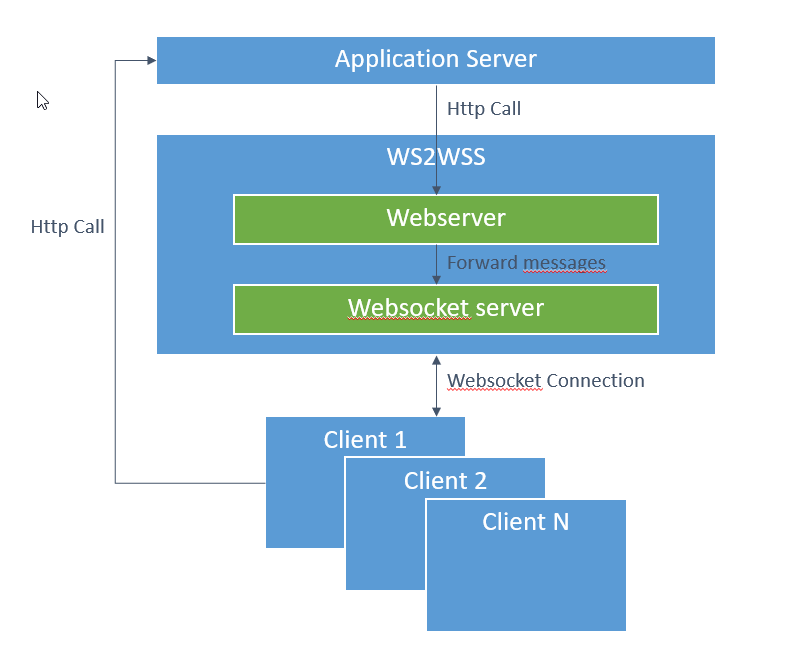

# WS2WSS
NodeJS Proxy from WebServer to WebSockerServer. 
Can be used as a middleware to push messages from a server to clients when the application server does not support a websocketserver by itself. 
My personal use-case for it is SAP MII. An application server that allows you to develop custom content on top but has no built-in mechanism for pushing content to the clients.

# Architecture
The webserver within ws2wss hosts a webservice '/forwardJSON' that can be called by your application server to forward messages.
Of course this will require your application server to be able to perform HTTP requests but this is a far more basic feature than a built-in websocket server. 

All messages received on the ws2wss webserver will be forwarded onto the websocketserver.
Every websocket client that is connected can receive the message depending on the channels that it subscribed on.

The communication in the other direction (clients to server) is done by direct HTTP. This direction is not supported by ws2wss.

# Channels
Channels are a mechanism used to filter what messages the client wants to receive. As the ws2wss is a central component it can be used to pass messages for different applications. By subscribing the client only to the relevant channels you can avoid receiving redundant messages.

A channel is simply a string of characters. For example a channel 'users'.
Whenever a user is altered (CRUD) on the server side; the server can broadcast a message to ws2wss using the 'users' channels.
Only the websocket clients that are interested in changes on user data can subscribe to this channel and will receive the messages that are send by the server.

# Installation
The ws2wss executable should be installed as a service (for example using NSSM).

following parameters can be passed when starting the executable:

--ws : the port on which to run the webserver. 

--wss : the port on which to run the websocket server. 

*Example:* 
`ws2wss.exe --ws="8081" --wss="8080"`

# Server-side usage

The server can forward JSON data by doing a POST to '/forwardJSON'. The only mandatory attribute in the body is the 'channel'. 
It is recomended to also have a 'data' attribute to put the actually payload of the message in and a 'messageType' attribute. The latter can be used in the client side to distuinguish between all the different messages that flow through the application.

    {
        "channel" : "channel1", 
        "data" : "anyDataInJSONFormat",
        "messageType" : "messageType1"
    }

# Client-side usage
Setting up a connection consists of 2 steps
1. Open websocket connection
2. On opened, Send a message to the websocket server to subscribe to specific channels

Example snippet

    private wsDataReceived: Subject<any> = new Subject();
    private websocket: WebSocket;
    private websocketUrl: string;
    private reconnectTimeout: any;
   
    /**
     * @description connect to websocket to listen for messages pushed from backend. Returns Subject.
     * @param url Url to websocket; example 'ws://localhost:8080'
     * @param channels Channels to subscribe to from the backend (array or single string)
     */
    public connectWebsocket(url: string, channels: any): Subject<any> {
      if (url !== this.websocketUrl) {
        this.websocketUrl = url;
        if (this.websocket) this.websocket.close();
        if (!(channels instanceof Array)) channels = [channels];
        this.openWebsocket(channels);
      }
   
      return this.wsDataReceived;
    }
   
    // Open websocket
    private openWebsocket(channels) {
      var self = this;
   
      if (self.reconnectTimeout) {
        clearTimeout(self.reconnectTimeout);
        self.reconnectTimeout = undefined;
      }
   
      this.websocket = new WebSocket(this.websocketUrl);
   
      this.websocket.onopen = function () {
        self.websocket.send(JSON.stringify({ channels: channels }));
        console.log('WebSocket Client Connected');
      };
   
      this.websocket.onclose = function (event) {
        console.log('WebSocket Client Closed');
        // Retry connection if not closed intentionally
        if (event.code != 4000) {
          if (self.reconnectTimeout) {
            clearTimeout(self.reconnectTimeout);
            self.reconnectTimeout = undefined;
          }
          setTimeout(self.openWebsocket.bind(self, channels), 5000);
        }
      };
   
      this.websocket.onmessage = function (e) {
        if (typeof e.data === 'string') {
          self.wsDataReceived.next(e.data);
        }
      };
    }

